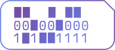

  
  
  # Punchcard - Daily Time Tracker
  
  A simple daily time tracking webapp built with Go and HTMX.

## Screenshots

  
| Daily View | Monthly Overview |
|------------|------------------|
|  |  |
| *Track your daily tasks with real-time timers* | *Visual monthly overview with calendar grid* |

## Architecture

- **Backend:** Go with Gorilla Mux router
- **Frontend:** HTML with HTMX for dynamic interactions
- **Styling:** Custom CSS with modern design
- **Data:** SQLite database storage (data persists between restarts)

## API Endpoints

- `GET /` - Redirects to today's date
- `GET /{date}` - Main application page for specific date (YYYY-MM-DD)
- `GET /month/{month}` - Monthly overview page (YYYY-MM format)
- `POST /{date}/add` - Add new time entry (auto-starts)
- `POST /{date}/start-stop/{id}` - Toggle timer for entry
- `GET /{date}/update-timer/{id}` - Get current timer value
- `POST /{date}/edit-time/{id}` - Update timer duration (supports decimal hours)
- `POST /{date}/edit-description/{id}` - Update entry description
- `DELETE /{date}/delete/{id}` - Delete time entry

## Next Steps

Future enhancements could include:
- Yearly summary views and trends
- User authentication and multi-user support
- Export functionality (CSV, PDF reports)
- Project categorization and tagging
- Time goals and targets
- Data backup and sync features
- Detailed time analytics and reporting
- REST API for integrations
- Mobile-responsive improvements
- Dark mode theme
